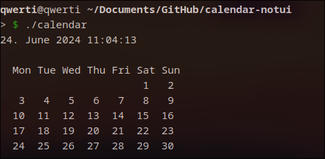

## Text based calendar in C that displays current date and shows the calendar for the month.

# Screenshot:
</img>

# How to use

```
git clone https://github.com/ondrejhonus/calendar-notui.git"
```
```
cd calendar-notui
```
```
make calendar
```
```
./calendar
```
